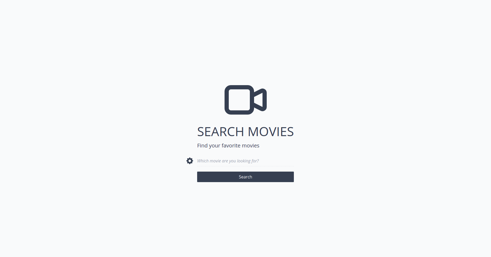
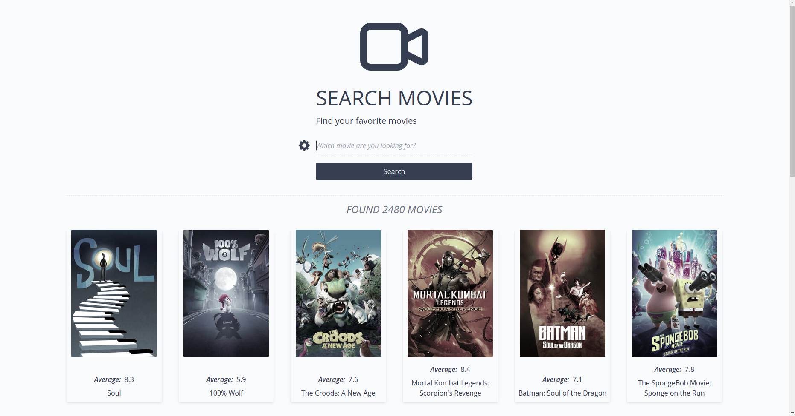
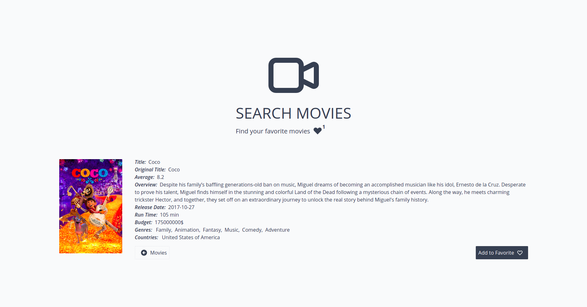

## Movie App

Single page application built on the React framework.

## Description

The main goal of the project is improve designer skills by using Tailwindcss library. Also the project is designed to demonstrate knowledge and practical skills of React framework, work with http reuqests and testing application with Jest.

### Demo

https://project-movie-app.netlify.app

#### Screenshots of the app

### Technologies

- React
- Tailwindcss
- React Router
- Jest

#### Backend

- TMDb API (https://www.themoviedb.org)

### Features

- Search for movies in the Movie Database (TMDb) 
- Search for a movie by year, genre or data release
- Get additional information of specific movie
- Loading new movies by scrolling the page
- Add/remove movie to/from favorite list
- Favorite movies list available after page reload (local storage)
- Adaptive design on all devices

## Getting started

  App requires to have node (4.x.x) and npm (2.x.x) installed.

#### Start with installing the dependencies:

  Run `npm install` to install all required packages.

## Replacing API KEY
  
  In order to have ability to make requests to the server. In root project folder crete new file .env.local and paste your personal api key from TMDB API (https://www.themoviedb.org)

#### Running:

  Use `npm run dev` to start the dev server.
  

